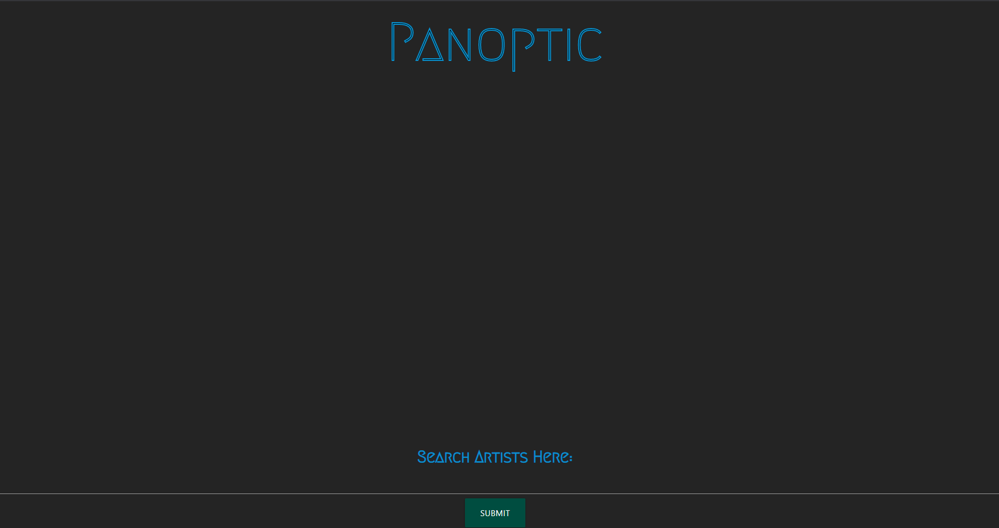
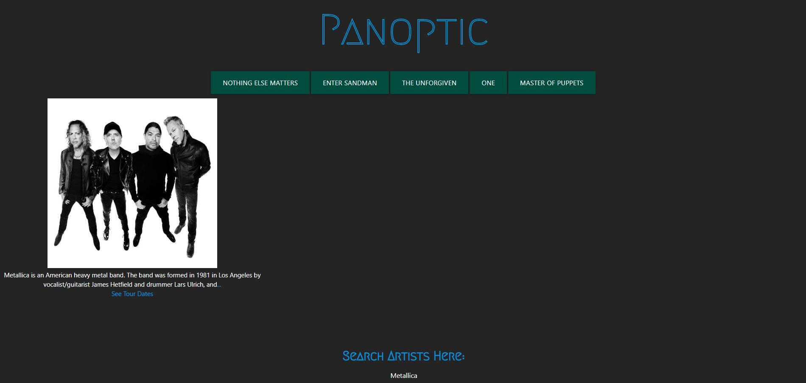

# Project-1

<!-- Name
Choose a self-explaining name for your project. -->
# README PROJECT 1

## Description
We have created a web application that lets users enter for their favorite artist. When user inputs in the search box the following will happen

* Recieve an image of the artist                ... ✔
* Recieve songs that the artist has             ... ✔
* Recieve lyrics to the song selected           ... ✔
* Recieve information of the artist via wiki    ... ✔
* Recieve a link if the artist is on tour       ... ✔
* Recieve a Video on the selected song          ... ✔

## Visuals

## Usage
Enter an artist you can think of in the search bar. You will recieve information about the artist with songs that are popular by the atist and information about the artist via Wikipedia. Clicking on any of the songs will display song lyrics, if the song does not have any lyrics then it will display with an error. Alongside the lyrics a youtube video will pop up as well as a link to tour dates if the aritst has any upcoming tour dates. 

Overall we belive that this is an easy to use application for any use to find the quickest information about an artist.

## Roadmap
* Finding API's                             ... ✔
* Found BandInTown API                      ... ✔
* Found MourtzLyrics API                    ... ✔
* Calling API's in js.logic                 ... ✔
* Creating the webpage using Materialize    ... ✔
* Creating and upadating ReadMe             ... ✔
* Found Youtube API for addding Video       ... ✔
* Found WIKIPEDIA API for Artist Infomation ... ✔
* Added Favicon                             ... ✔

## Authors and acknowledgment
* Christian Maldonado
* Matt Bayers
* Niles Bingham
* Omar Abbasi

## Contributing
Not Open to Contributers

## Project Status
* Finished with core functions
* Adding bells and whistles now to finished projects